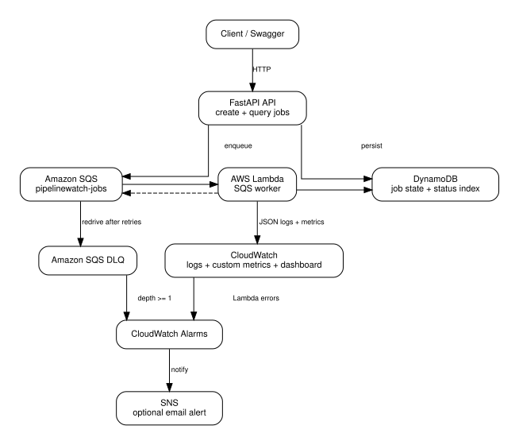

# PipelineWatch

PipelineWatch is a cloud-native observability and recovery service for data-pipeline jobs. It tracks job state, processing failures, retries, dead-letter events, and pipeline health while demonstrating production-oriented AWS patterns: SQS redrive, Lambda partial batch failures, DynamoDB access patterns, least-privilege IAM, CloudWatch metrics/alarms, structured logs, and Terraform-managed infrastructure.



## What v0.3 adds

- AWS Lambda replaces the always-on polling worker in the deployed path.
- DynamoDB replaces SQLite for AWS job state; SQLite remains available for zero-cost local development.
- SQS event-source mapping uses `ReportBatchItemFailures`, so successful records are removed while failed records are retried.
- Queue-level redrive moves repeatedly failing messages into a real DLQ.
- CloudWatch receives `JobsSucceeded`, `JobsFailed`, `JobsSentToDLQ`, and `ProcessingLatencyMs` custom metrics.
- CloudWatch dashboard and alarms cover Lambda reliability and DLQ depth.
- SNS can deliver optional alarm email notifications.
- IAM scopes the Lambda worker to its source queue, DynamoDB table/indexes, CloudWatch namespace, and basic Lambda logs.
- JSON structured logging carries a correlation ID from API creation through SQS and Lambda processing.
- GitHub Actions runs Python tests and Terraform validation on pushes and pull requests.

## Architecture

```text
Client
  |
  v
FastAPI API ---------> DynamoDB
  |                      ^
  | enqueue              | status updates
  v                      |
Amazon SQS ----------> AWS Lambda --------> CloudWatch
  |                    partial failures     logs / metrics
  | retries                                  |
  v                                          v
SQS DLQ --------------------------------> CloudWatch alarms
                                                |
                                                v
                                               SNS
```

The API can run locally while using AWS SQS + DynamoDB, which keeps the project inexpensive while still exercising the real backend services.

## Repository layout

```text
PipelineWatch/
├── .github/workflows/ci.yml
├── app/
│   ├── config.py
│   ├── db.py
│   ├── dynamodb_store.py
│   ├── lambda_handler.py
│   ├── logging_utils.py
│   ├── main.py
│   ├── metrics.py
│   ├── models.py
│   ├── queue.py
│   ├── service.py
│   ├── store.py
│   └── worker.py
├── architecture/
│   ├── pipelinewatch-phase3.svg
│   └── pipelinewatch-phase3.png
├── infra/
│   ├── dynamodb.tf
│   ├── iam.tf
│   ├── lambda.tf
│   ├── main.tf
│   ├── monitoring.tf
│   ├── outputs.tf
│   ├── sqs.tf
│   └── variables.tf
├── tests/
├── .env.example
├── Makefile
├── requirements.txt
└── README.md
```

## Local quick start

```bash
python3 -m venv .venv
source .venv/bin/activate
python -m pip install -r requirements.txt
python -m pytest -q
uvicorn app.main:app --reload
```

Open Swagger at `http://127.0.0.1:8000/docs`.

Local mode defaults to SQLite and does not require AWS:

```bash
export JOB_STORE=sqlite
```

## Deploy AWS infrastructure

Prerequisites: AWS credentials configured locally and Terraform >= 1.6.

```bash
cd infra
terraform init
terraform fmt
terraform validate
terraform plan
terraform apply
```

Terraform provisions:

- SQS source queue and DLQ
- DynamoDB jobs table with `status-created-at-index`
- Lambda SQS worker
- SQS -> Lambda event source mapping with partial batch failure support
- least-privilege worker IAM permissions
- CloudWatch dashboard
- DLQ and Lambda-error alarms
- SNS alarm topic

To receive alarm email, set the optional variable:

```bash
terraform apply -var='alarm_email=you@example.com'
```

AWS will send an SNS subscription confirmation email before notifications begin.

## Configure the API for AWS mode

Get the Terraform outputs:

```bash
terraform output pipeline_queue_url
terraform output pipeline_dlq_url
terraform output dynamodb_table_name
```

From the project root:

```bash
export JOB_STORE=dynamodb
export AWS_REGION=us-east-1
export DYNAMODB_TABLE=pipelinewatch-jobs
export PIPELINE_QUEUE_URL='<terraform pipeline_queue_url>'
export PIPELINE_DLQ_URL='<terraform pipeline_dlq_url>'
export MAX_RECEIVE_COUNT=3
uvicorn app.main:app --reload
```

Do not commit AWS credentials or `.env`.

## Try a successful job

```bash
curl -X POST http://127.0.0.1:8000/jobs \
  -H 'Content-Type: application/json' \
  -d '{
    "pipeline_name": "orders",
    "payload": {"order_id": 123}
  }'
```

Flow:

```text
FastAPI -> DynamoDB -> SQS -> Lambda -> DynamoDB(succeeded)
                                  |
                                  +-> CloudWatch metrics/logs
```

## Exercise retry and DLQ behavior

`force_fail` is intentionally a demo-only switch.

```bash
curl -X POST http://127.0.0.1:8000/jobs \
  -H 'Content-Type: application/json' \
  -d '{
    "pipeline_name": "payments",
    "payload": {
      "payment_id": "p-100",
      "force_fail": true
    }
  }'
```

On a failed Lambda record:

1. PipelineWatch marks the job failed.
2. Lambda returns that record in `batchItemFailures`.
3. SQS retries after the visibility timeout.
4. On the final configured receive, PipelineWatch marks the job `dlq`.
5. SQS redrive moves the message to the DLQ.
6. The DLQ-depth alarm enters ALARM when a message is visible.

## Correlation IDs and structured logs

Each job receives a correlation ID when created. It is propagated in the SQS message and included in structured Lambda log events:

```json
{
  "level": "INFO",
  "service": "pipelinewatch",
  "event": "lambda_job_succeeded",
  "job_id": "...",
  "correlation_id": "...",
  "message_id": "...",
  "receive_count": 1
}
```

This makes one job traceable across API creation, queue delivery, retries, and worker execution.

## API endpoints

| Method | Endpoint | Purpose |
|---|---|---|
| `GET` | `/health` | Service, storage, and SQS configuration health |
| `POST` | `/jobs` | Create a job and enqueue it when SQS is configured |
| `GET` | `/jobs` | List recent jobs |
| `GET` | `/jobs/{id}` | Fetch one job |
| `POST` | `/jobs/{id}/process` | Local/manual processing path for demos/tests |
| `POST` | `/jobs/{id}/retry` | Requeue a failed/DLQ job |
| `GET` | `/metrics` | Job-state metrics from the active store |
| `GET` | `/queue/metrics` | Approximate SQS and DLQ depth |

## Design decisions

**SQS instead of synchronous processing.** The API acknowledges job creation independently of the worker, allowing backpressure and retry behavior to be handled by the queue.

**Lambda partial batch failures.** Returning only failed message IDs prevents one bad record from causing already-successful records in the same batch to be retried.

**DynamoDB access pattern.** Jobs use `id` as the partition key. A `status-created-at-index` GSI supports status-filtered views ordered by creation time. The aggregate `/metrics` endpoint scans state intentionally for this portfolio-scale demo; at larger scale those metrics would be pre-aggregated or sourced from CloudWatch.

**Queue-level retry policy.** SQS redrive is authoritative for AWS retry/DLQ behavior. The job's `max_retries` remains useful for the local/manual path.

**Metrics are non-blocking.** A CloudWatch metrics failure must not convert successful business processing into an SQS retry, so metric publication is best-effort.

**SQLite remains local-only.** It keeps onboarding and tests simple while DynamoDB demonstrates the deployed storage model.

## CI

GitHub Actions runs:

```text
pytest
terraform fmt -check
terraform init -backend=false
terraform validate
```

No AWS credentials are required by CI because it validates infrastructure rather than applying it.

## Cost / cleanup

This project uses pay-per-request DynamoDB and request-based Lambda/SQS services, but AWS usage can still incur charges. Destroy demo infrastructure when you are finished:

```bash
cd infra
terraform destroy
```

## Portfolio talking points

- Why SQS + DLQ is preferable to application-owned retry loops for this workload
- Visibility timeout and `maxReceiveCount` tradeoffs
- Lambda partial batch responses and idempotency considerations
- DynamoDB partition/GSI choices based on access patterns
- Failure isolation between processing and observability
- Correlation IDs for distributed troubleshooting
- Least-privilege IAM boundaries
- CloudWatch alarm and dashboard design
- Local SQLite mode versus deployed DynamoDB mode

## Roadmap

v0.3 is the intended portfolio-complete architecture. Future work would focus on depth rather than adding more services: idempotency tokens, replay tooling, load tests, and pre-aggregated operational metrics.
